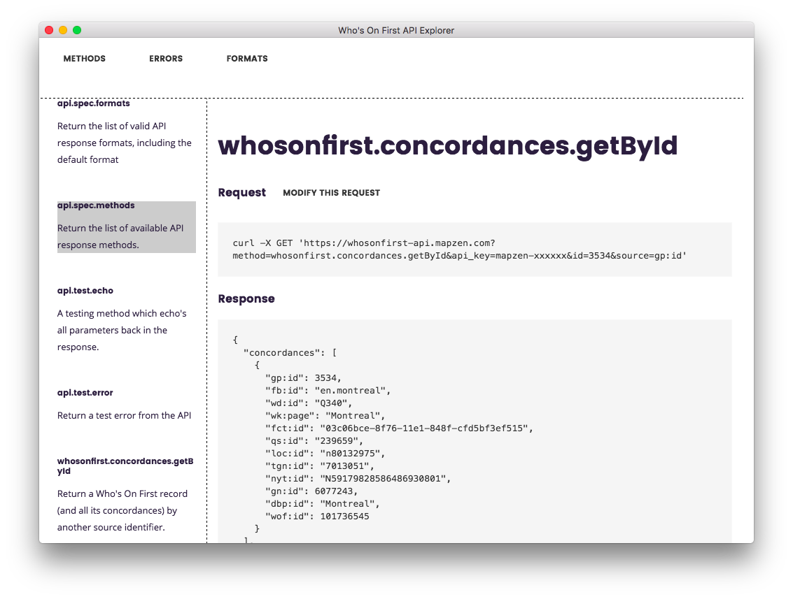

# electron-whosonfirst-api-explorer



An Electron-based API explorer for the Who's On First API.

## Caveats

Too soon. Move along.

## Install

```
# Clone this repository
git clone https://github.com/whosonfirst/electron-whosonfirst-api-explorer
# Go into the repository
cd electron-whosonfirst-api-explorer
# Install dependencies
npm install
# Run the app
npm start
```

## Notes

This began life as a straight clone of the [electron-quick-start](https://github.com/electron/electron-quick-start) application.

## See also

* https://mapzen.com/documentation/wof/
