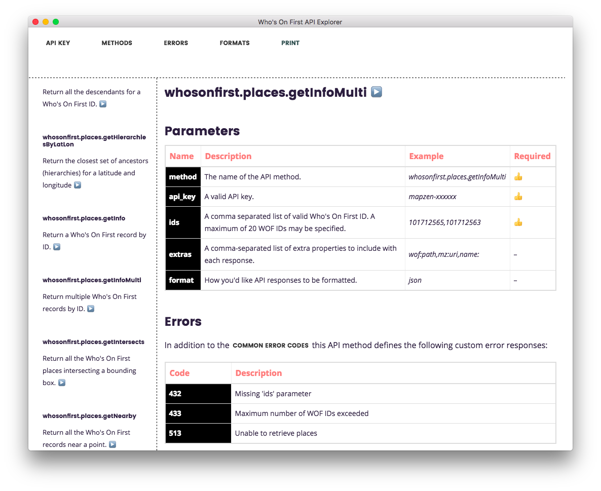
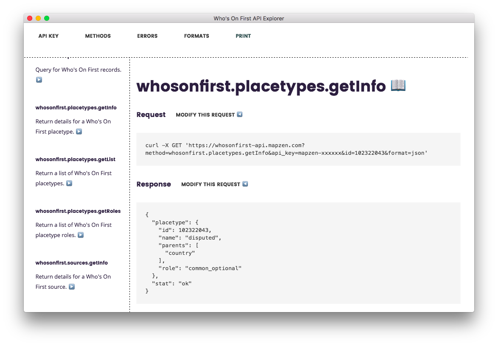

# electron-whosonfirst-api-explorer

An Electron-based API explorer for the Who's On First API.

## Pictures or it didn't happen!






## Caveats

[Work in progress](https://github.com/whosonfirst/electron-whosonfirst-api-explorer/issues). This works but should still be understood as "tilting towards beta". 

## Install

First of all you will need to have [Git](https://git-scm.com/), [Node.js](https://nodejs.org/) and [npm](https://www.npmjs.com/) installed. On a Mac these are all easy to install with the [Homebrew](https://brew.sh/) package manager. On Linux all the dependencies are available via tools like `apt` or `yum`. On Windows I'm afraid I have no idea what the state of the art is these days.

Once all the dependencies are installed:

```
# Clone this repository
git clone https://github.com/whosonfirst/electron-whosonfirst-api-explorer

# Go into the repository
cd electron-whosonfirst-api-explorer

# Install dependencies
npm install

# Run the app
npm start
```

Pre-compiled native binaries are on the list but they haven't happened yet. Sorry.

## What's up with the application icon?

`※` is the Unicode character for a [reference mark](https://thisisaaronland.github.io/unicode-table/#8251).

## See also

* https://mapzen.com/blog/whosonfirst-api-explorer/
* https://mapzen.com/documentation/wof/
* https://electron.atom.io/
